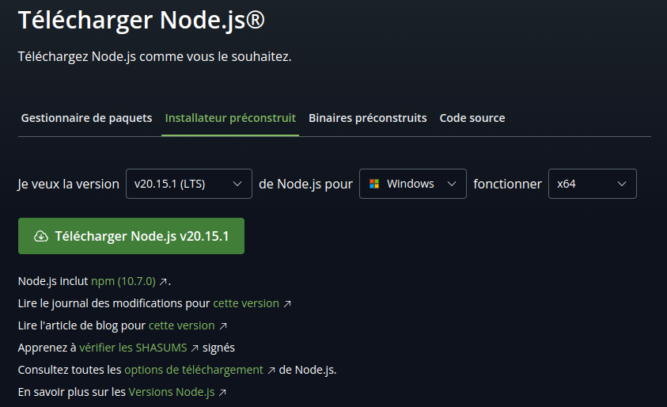
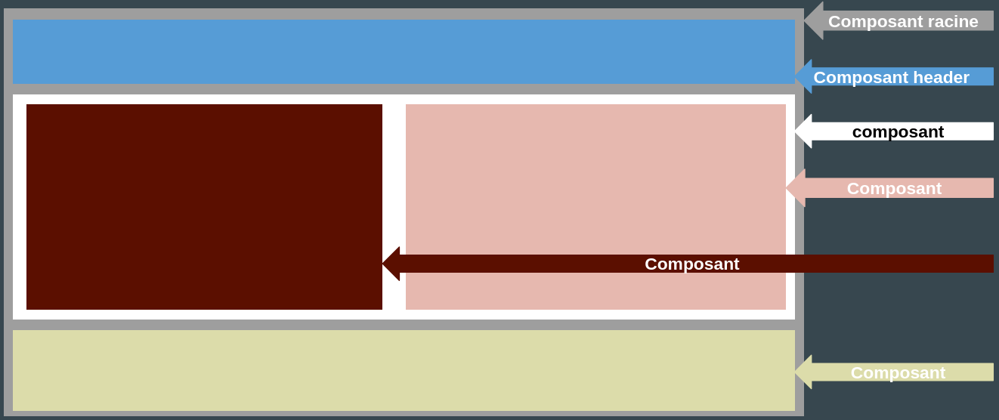
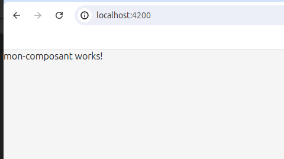

# Développement Web avec Angular
## Introduction au framework Angular
- **Qu'est ce que Angular?**

    Angular est un framework **Open source** développé par Google. Il est bassé sur le langage **TypeScript** et permet de developper des applications web mono page ou Single Page Application (**SPA**).

- **Historique et versions d'Angular**

    Angular a connu une évolution significative depuis sa création en 2010, en passant par plusieurs versions majeures et en introduisant des fonctionnalités et des paradigmes de développement révolutionnaires.

    - **Les origines : AngularJS (2010-2016)**
    
        AngularJS, lancé par Google en 2010, est un framework JavaScript open source pour le développement d'applications web dynamiques. Il a rapidement gagné en popularité grâce à sa liaison de données bidirectionnelle et son modèle MVC. Cependant, avec l'évolution des technologies web, AngularJS a montré ses limites en termes de complexité notemment grace à son architecture monolithique, rendant difficile le développement d'applications à grande échelle.

    - **Une réécriture complète : Angular 2+ (2016-présent)**

        En réponse à ces limitations, Google a entrepris une réécriture complète du framework, aboutissant à la publication d'Angular 2 en 2016. Cette nouvelle version représentait une rupture significative avec AngularJS, en adoptant une architecture modulaire basée sur les composants, TypeScript comme langage de développement principal et une approche plus moderne et réactive.

## Installation et Configuration
1) Node.js et npm :
Angular nécessite Node.js et npm. Vous pouvez vérifier si Node.js et npm sont installés sur votre machine avec les commandes suivantes :

    ```sh
    node -v
    npm -v
    ```
Si Node.js et npm ne sont pas installés, téléchargez et installez-les depuis le site officiel de Node.js.
- Allez sur le site officiel de Node.js : https://nodejs.org/
- Téléchargez la version LTS (Long Term Support) pour plus de stabilité.
    
2) Angular CLI :
Angular CLI (Command Line Interface) est un outil qui vous aide à créer, gérer et développer des projets Angular. Installez-le globalement sur votre machine avec la commande suivante :

    ```sh
    npm install -g @angular/cli
    ```
Vérifiez que l'installation s'est bien déroulé avec la commande suivante :
```sh
ng v
```
3) Création d'un Nouveau Projet Angular :
Utilisez Angular CLI pour générer un nouveau projet Angular. Remplacez mon-projet-angular par le nom de votre projet.

    ```sh
    ng new mon-projet-angular
    ```
4) Lancer le serveur de développement : 
Avec le terminal lancez le serveur en tapant la commande suivante :

    ```sh
    ng serve
    ```
Par défaut, l'application sera accessible à l'adresse http://localhost:4200.
## Les Bases d'Angular
- **Les Composants** :
Un composant est une unité fondamentale dans une application Angular. Il encapsule la logique, le modèle (template) et les styles pour une partie spécifique de l'interface utilisateur. Les composants permettent de diviser une application en morceaux plus petits, plus gérables et réutilisables.


- **Templates** :
Un template est une partie essentielle de la définition d'un composant. Il s'agit d'une structure HTML qu'Angular utilise pour rendre les vues dans l'application. Les templates peuvent inclure des balises HTML standard, des directives Angular, des composants Angular et des interpolations de données.

  ```html
  <div>
    <h1>{{ title }}</h1>

    <!-- Directive structurelle *ngIf -->
    <p *ngIf="isVisible">Ce paragraphe est visible.</p>

    <!-- Directive structurelle *ngFor -->
    <ul>
    <li *ngFor="let item of items">{{ item }}</li>
    </ul>

    <!-- Binding de propriétés -->
    
  </div>
  ```
- **Directives** :
Les directives sont des instructions qu'Angular utilise pour attacher un comportement particulier à des éléments DOM. Elles sont un aspect essentiel de la façon dont Angular ajoute de la logique et de l'interactivité à vos applications.
  ```html
  <!-- ngClass ajoute ou retire des classes CSS en fonction de l'evaluation d'une expression. -->
  <div [ngClass]="{'active': isActive, 'inactive': !isActive}">Contenu</div>
  <!-- ngStyle applique des styles CSS dynamiquement a un élément. -->
  <div [ngStyle]="{'color': isActive ? 'green' : 'red'}">Contenu</div>
  <!-- ngModel lien bidirectionnel entre une donnee et un elment de formulaire. -->
  <input [(ngModel)]="username" placeholder="Entrez votre nom">
  <!-- ngIf ajoute ou supprime un element du DOM en fonction de la valeur d'une expression. -->
  <p *ngIf="isVisible">Ce paragraphe est visible.</p>
  <!-- ngFor repete un element pour chaque element d'un tableau. -->
  <ul>
    <li *ngFor="let item of items">{{ item }}</li>
  </ul>
  ```
- **Pipes** :
Les pipes en Angular sont utilisés pour transformer les données dans les templates. Ils permettent de modifier l'affichage des données sans changer les données sous-jacentes.
  ```html
  {{ today | date }} <!-- Formate la date actuelle avec le format par défaut -->
  {{ today | date:'short' }} <!-- Formate la date avec un format court -->
  {{ today | date:'fullDate' }} <!-- Formate la date avec le format de date complet -->
  {{ 'Angular' | uppercase }} <!-- affiche  ANGULAR -->
  {{ 'Angular' | lowercase }} <!-- affiche  angular -->
  {{ amount | currency }} <!-- Formate avec la devise par défaut (USD) -->
  {{ amount | currency:'EUR' }} <!-- Formate avec l'euro -->
  ```
- Services et Injection de dépendances
Les services et l'injection de dependances sont des concepts qui permettent de structurer et de gérer efficacement la logique métier et les dépendances de votre application.
    - **Service** :
    Un service est une classe qui contient des données ou de la logique métier pouvant être partagées entre différents composants. Les services sont utilisés pour encapsuler des fonctionnalités telles que la récupération de données, les calculs, etc.
    - **Injection de dépendances**
    L'injection de dépendances est un modèle de conception utilisé pour gérer les dépendances dans votre application. Angular dispose d'un mécanisme d'injection de dépendances intégré qui permet d'injecter des services dans des composants, d'autres services ou des directives.

## Création d'un composants
La création de composants dans un projet Angular est une tâche courante, voici comment créer un composant Angular en utilisant l'outil Angular CLI :
```sh
ng generate component mon-composant
```
ou
```sh
ng g c mon-composant
```
Cela créera un dossier nommé mon-composant dans le répertoire "Src/app" à l'intérieur duquel il crée plusieurs fichiers :
- src/app/mon-composant/mon-composant.component.ts : Fichier TypeScript du composant.
- src/app/mon-composant/mon-composant.component.html : Template HTML du composant.
- src/app/mon-composant/mon-composant.component.css : Styles CSS du composant.
- src/app/mon-composant/mon-composant.component.spec.ts : Fichier de test du composant.
Si vous ne souhaitez pas avoir le fichier de test tapez la commande suivante:
```sh
ng g c mon-composant --skip-tests
```
Le code suivant représente le code minimal de base d'un composant angular
```ts
// mon-composant.ts
import { Component } from '@angular/core';

@Component({
  selector: 'app-mon-composant',
  standalone: true,
  imports: [],
  templateUrl: './mon-composant.component.html',
  styleUrl: './mon-composant.component.css'
})
export class MonComposantComponent {

}
```
## Utilisation d'un composant
Après avoir creer un composant, vous pouvez utiliser ce composant dans d'autre composants selon vos besoins. Ici nous allons utiliser le composant mon composant dans le composant app qui est le composant principale de l'application.

Dans le fichier *app.component.ts* importez le composant "MonComposantComponent" puis modifier la propriété imports du décorateur de la manière suivante:
```ts
// app.component.ts
import { MonComposantComponent } from './mon-composant/mon-composant.component';

@Component({
  selector: 'app-root',
  standalone: true,
  imports: [RouterOutlet, MonComposantComponent],
  templateUrl: './app.component.html',
  styleUrl: './app.component.css'
})
export class AppComponent {
  title = 'app';
}
```
Et enfin dans le fichier *app.component.html* afficher le composant mon composant en utilisant la propriété selector du décorateur dans le fichier *mon-composant.component.ts* comme une balise de la maniere suivante :
```html
<div class="app">
  <app-mon-composant></app-mon-composant>
</div>
```
Vérifier votre application sur le navigateur; vous devriez voir quelque chose qui ressemble à la figure suivante.


## Exercice:
Créer un composant header qui représentera la barre de navigation du site.
1) Utilisez Angular CLI pour générer le nouveau composant.
2) Ajoutez du HTML pour créer une barre de navigation simple avec au moins trois liens de navigation (par exemple, Home, Register et Login).
3) Intégrez le composant Header dans le composant principal de l'application (AppComponent) en utilisant le sélecteur du composant (n'oubliez pas de faire les importations nécessaires).

###### A vous...

## Stylisation
La stilisation des composant dans une application se gère au niveau des  fichiers css de chaque composant. (nous allons ajouter du style au composant header creer dans l'exercice precedent).

## Utilisation des directives
Pour utiliser les directives dans angular il faut suivre les etapes suivantes:
1) importer le module : CommonModule dans le composant ou on souhaite utiliser des directive puis l'ajouter dans l'attribut imports du decorateur.
    ```ts
    import { CommonModule } from '@angular/common';
    @Component({
      ...
      imports: [..., CommonModule, ...],
      ...
    })
    ```
2) Declarer l'attribut dans la classe du composant
    ```ts
    color: string = "bleue";
    ```
3) Utiliser la directive dans le template du composant
    ```html
    <h2 [ngClass]="{'rouge': color === 'red', 'bleue': color === 'blue'}">Items List</h2>

    <p [ngStyle]="{'color': color}">Lorem ipsum dolor sit.</p>

    <p *ngIf="isVisible">Ce paragraphe est visible.</p>
    ```
## Exercice:
Créer un composant Angular nomme TodoList qui affiche une liste de taches (todos). Chaque tache doit avoir un id, un name, et un status. Les taches doivent etre stylisees en fonction de leur etat :
- En orange si la tache est "en cours" (in-progress).
- En vert si la tache est "terminee" (completed).
1) Créer un composant Angular nommé TodoList.
2) Initialiser un tableau de todos dans le composant avec des valeurs fictives.
    - Chaque todo doit avoir un id, un name, et un status (soit in-progress, soit completed).

Exemple de Données :
```ts
todos = [
  { id: 1, name: 'Faire les courses', status: 'in-progress' },
  { id: 2, name: 'Finir le projet', status: 'completed' },
  { id: 3, name: 'Appeler le médecin', status: 'in-progress' },
  { id: 4, name: 'Nettoyer la maison', status: 'completed' }
];
```
###### A vous...

# Creation et utilisation d'un service
1) Création d'un service:
Utilisez Angular CLI pour générer un service. Par exemple, pour créer un service nommé DataService :
```sh
ng generate service data --skip-tests
```
Cela creera un fichier *data.service.ts*
2) Implémentation du service
```ts
// data.service.ts
import { Injectable } from '@angular/core';

@Injectable({
  providedIn: 'root',
})
export class DataService {
  private items: string[] = ['Item 1', 'Item 2', 'Item 3'];

  constructor() { }

  getItems(): string[] {
    return this.items;
  }

  addItem(item: string): void {
    this.items.push(item);
  }
}
```
3) Injecter le service dans un composant
Pour utiliser le service, vous devez l'injecter dans un composant. Ici nous allons l'injecter dans le composant mon-composant précédemment créé.
```ts
// mon-composant.component.ts
import { Component, OnInit } from '@angular/core';
import { DataService } from '../data.service';
import { CommonModule } from '@angular/common';

@Component({
  selector: 'app-mon-composant',
  standalone: true,
  imports: [CommonModule],
  templateUrl: './mon-composant.component.html',
  styleUrl: './mon-composant.component.css'
})
export class MonComposantComponent implements OnInit{
  items: string[] = [];
  constructor(private dataService: DataService){}

  ngOnInit(): void {
    this.items = this.dataService.getItems();
  }
}
```
3) Mofdification du template
Nous devons modifier le template pour qu'il puisse afficher la liste des items définis dans le service.
```html
<!-- mon-composant.component.html -->
<div>
  <h2>Items List</h2>
  <ul>
    <li *ngFor="let item of items">{{ item }}</li>
  </ul>
</div>
```
4) Vérification
vérifiez dans le navigateur si vous voyez bien la liste des items et essayez d'ajouter des valeurs.

## Exercice:
Faire evoluer l'exercice precedent en centralisant les donnees des taches (todos) dans un service Angular nomme TodoService.
1) Creer un service Angular nomme TodoService.
2) Initialiser un tableau de todos dans le service avec des valeurs fictives.
3) Modifier le composant TodoList pour utiliser le service TodoService et afficher la liste des taches comme dans l'exercice precedent.
###### A vous...

## Routage et Navigation
Le routage permet de naviguer entre différentes vues ou composants de l'application.

Nous alons à present creer un composant login et un composant register à l'aide de Angular CLI.

Nous allons modifier le composant header pour que le click sur les liens: home, login et register puisse rediriger respectivement vers les urls:  (http://localhost:4200/), (http://localhost:4200/login) et (http://localhost:4200/register).
```html
<!-- header.component.html -->
<header class="fixed-top">
    <nav class="navbar navbar-expand-lg">
        <div class="container-fluid">
            <a class="navbar-brand" routerLink="">Home</a>
            <button class="navbar-toggler" type="button" data-bs-toggle="collapse"
                data-bs-target="#navbarSupportedContent" aria-controls="navbarSupportedContent" aria-expanded="false"
                aria-label="Toggle navigation">
            </button>
            <div class="collapse navbar-collapse" id="navbarSupportedContent">
                <ul class="navbar-nav me-auto mb-2 mb-lg-0 d-flex justify-content-end w-100">
                    <li><a class="navbar-brand" routerLink="register">Register</a></li>
                    <li><a class="navbar-brand" routerLink="login">Login</a></li>
                </ul>
            </div>
        </div>
    </nav>
</header>
```
Dans le fichier ts du composant imprter les modules : RouterLink, RouterLinkActive, RouterOutlet
```ts
// header.component.ts
import { RouterLink, RouterLinkActive } from '@angular/router';
@Component({
  //...
  imports: [RouterLink, RouterLinkActive],
  // ...
})
```
Dans le fichier *app.routes.ts* ous allons renseigner les différentes routes.
```ts
export const routes: Routes = [
    { path: "", component: HomeComponent },
    { path: "login", component: LoginComponent},
    { path: "register", component: RegisterComponent}
];
```
Enfin dans le composant principal ajouter la ligne suivante qui va permettre d'injecter le bon composant dans la composante principale en fonction du lien sur lequel l'utilisateur a cliqué.
```html
<app-header></app-header>
<div class="app">
  <router-outlet></router-outlet>
</div>
```

## Les formulaires
Les formulaires sont une partie essentielle de nombreuses applications web, permettant aux utilisateurs de saisir et de soumettre des données qui par la suite peuvent etre enregistrer dans des bases de données.

Nous allons prendre l'exemple du formulaire de connexion en modifiant les fichier du composant comme suivant: importation des module FormBuilder, FormGroup, Validators et ReactiveFormsModule.
```ts
// login.component.ts
import { FormBuilder, FormGroup, Validators } from '@angular/forms';
import { CommonModule } from '@angular/common';
import { ReactiveFormsModule } from '@angular/forms';

@Component({
  // ...
  imports: [ReactiveFormsModule, CommonModule],
  // ...
})

export class LoginComponent {

  monFromulaire: FormGroup;

  constructor(private fb: FormBuilder){
    this.monFromulaire = this.fb.group({
      email: ['', [Validators.required, Validators.email]],
      password: ['', [Validators.required, Validators.minLength(6)]]
    });
  }

  onSubmit(){
    if(this.monFromulaire.valid){
      console.log(this.monFromulaire.value);
    }
  }
}
```
```html
<!-- login.component.html -->
<div class="container">
    <div class="w-50">
        <form [formGroup]="monFormulaire" (ngSubmit)="onSubmit()">
            <div class="mb-3">
              <label class="form-label">Email address</label>
              <input type="email" class="form-control" formControlName="email">
              <div *ngIf="monFormulaire.get('email')?.invalid && monFormulaire.get('email')?.touched">
                <div *ngIf="monFormulaire.get('email')?.errors?.['required']">Email est requis</div>
                <div *ngIf="monFormulaire.get('email')?.errors?.['email']">format invalide</div>
              </div>
            </div>
            <div class="mb-3">
              <label class="form-label">Password</label>
              <input type="password" class="form-control" formControlName="password">
              <div *ngIf="monFormulaire.get('password')?.invalid && monFormulaire.get('password')?.touched">
                <div *ngIf="monFormulaire.get('password')?.errors?.['required']">mot de passe requis</div>
                <div *ngIf="monFormulaire.get('password')?.errors?.['minlength']">mot de passe trop court</div>
              </div>
            </div>
            <button type="submit" class="btn btn-primary">Login</button>
        </form>
    </div>
</div>
```
## Exercice
Avec le composant register créé précédemment creer un formulaire d'inscription avec quatre champs : email, password, pseudo et âge en vous inspirant de ce qu'on a fait avec le formulaire de connexion, ajoutez le code des fichiers du template. tous les champs sont requis l'email doit avoir un format valide. À l'envoie du formulaire afficher dans la console les informations saisies par l'utilisateur.
***À vous...***