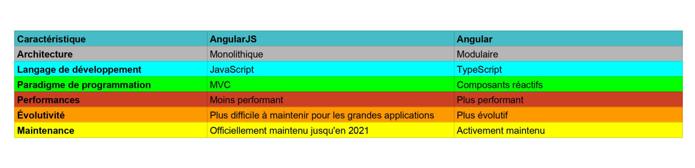

# Développement Web avec Angular
## Introduction au framework Angular
- **Qu'est ce que Angular?**

    Angular est un framework **Open source** développé par Google. Il est bassé sur le langage **TypeScript** et permet de developper des applications web mono page ou Single Page Application (**SPA**).

- **Historique et versions d'Angular**

    Angular a connu une évolution significative depuis sa création en 2010, en passant par plusieurs versions majeures et en introduisant des fonctionnalités et des paradigmes de développement révolutionnaires.

    - **Les origines : AngularJS (2010-2016)**
    
        AngularJS, lancé par Google en 2010, est un framework JavaScript open source pour le développement d'applications web dynamiques. Il a rapidement gagné en popularité grâce à sa liaison de données bidirectionnelle et son modèle MVC. Cependant, avec l'évolution des technologies web, AngularJS a montré ses limites en termes de complexité notemment grace à son architecture monolithique, rendant difficile le développement d'applications à grande échelle.

    - **Une réécriture complète : Angular 2+ (2016-présent)**

        En réponse à ces limitations, Google a entrepris une réécriture complète du framework, aboutissant à la publication d'Angular 2 en 2016. Cette nouvelle version représentait une rupture significative avec AngularJS, en adoptant une architecture modulaire basée sur les composants, TypeScript comme langage de développement principal et une approche plus moderne et réactive.
        
    

